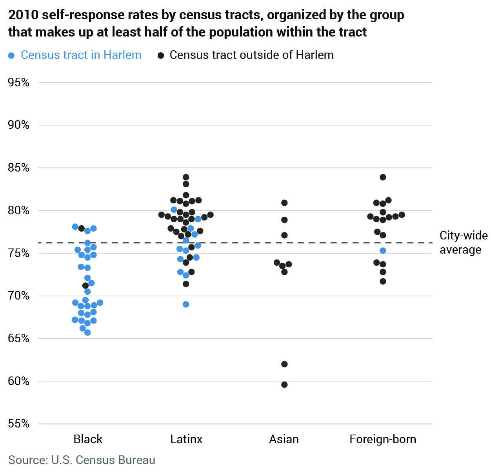
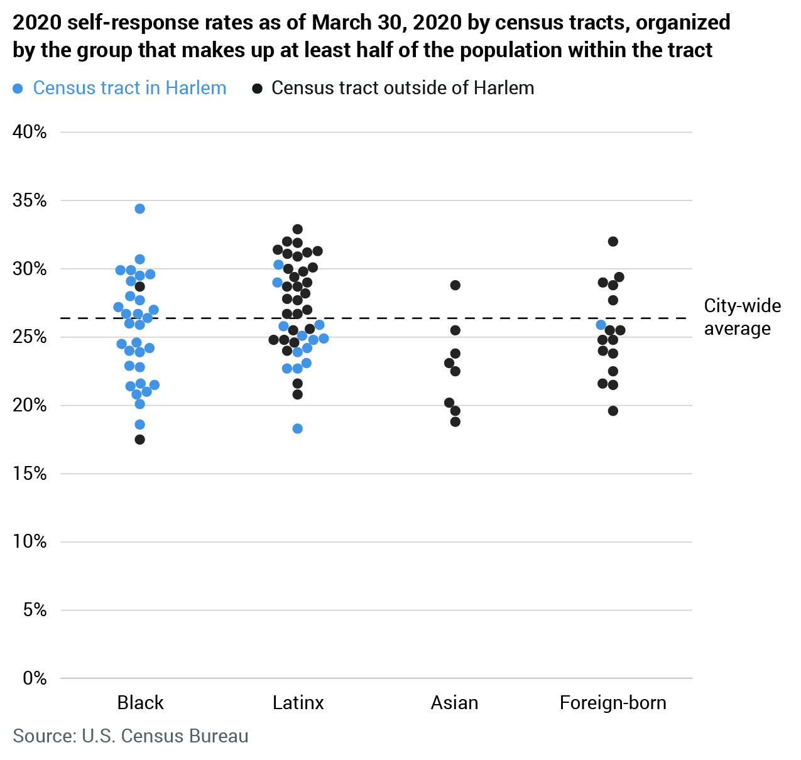

Looking at 2010 final and 2020 current self response data.

## Graphics Setup

This story was created with [Spectate](https://github.com/spec-journalism/spectate).

For cloning and usage instructions, see the [Spectate documentation](https://github.com/spec-journalism/spectate/#cloning-a-spectate-project).

## Data Setup

```
# Clone and move into the repository
$ git clone git@github.com:spec-journalism/census-self-response.git
$ cd census-self-response

# Setup virtual environment
$ pipenv install
$ pipenv shell

# Open the notebook
shell@ $ jupyter notebook
```

## Graphics




